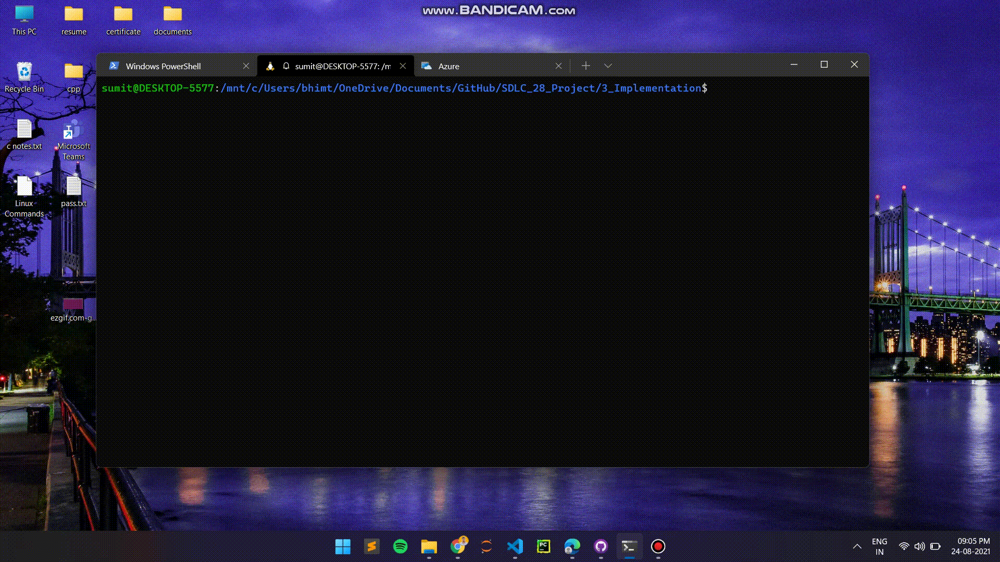

# SDLC Activity Based Learning
 

# Project on Textpad Password Maneger

* A fully functional password manager which involves operation to save the account credentials, retrive account credentials, generate passwords, delete account credentials.
* This project can be used by anyone in day to day life.
* The system mainly involves two operation modes. They modifying master username or password and user credential operations. 
* All the operation are subdivided into operations where user can choose the operation he wants and can perform accordingly.

 

## Badges

Build | Code Quality | Unit Testing | [Git Inspector](github.io option) | Code Coverage
------|----------|-------|--------------|--------|
 |      |  |  | 

## Project Demonstration

 

## Folder Structure

| Folder             | Description                                   |
| ------------------ | --------------------------------------------- |
| `1_Requirements`   | Documents detailing requirements and research |
| `2_Design`         | Documents specifying design details           |
| `3_Implementation` | All code and documentation                    |
| `4_Test_plan`      | Documents with test plans and procedures      |
| `5_Daily Updates`  | Updates for each day plan                     |

 

## Contributors List and Summary

| SF No.   | Name        | Features                 | Issuess Raised | Issues Resolved | No Test Cases | Test Case Pass |
| -------- | ----------- | ------------------------ | -------------- | --------------- | ------------- | -------------- |
| `99005633` | Ankit Kumar | Behavioral diagram, ,fileEncryptionDecryption.h, FileEncryptionDecryption.c, credentialFuntions.c, testTextPadFunctions.c | 2            | 1             | 20            | 20             |
| `99005691` | Sumit Bhimte | Github Workflows, common.h, credentialFunctions.h, masterAccountFunctions.h, passwordUsernameFormatChecker.h, sha256.h, Makefile| 1            | 1             | 20            | 20             |
| `99005699` | Anurag Thakur | credential.c, testTextPadFunctions.c, Project_main.c | Nil            | 1             | 20            | 20             |
| `99005665` | Harish Chappidi | MasterFunctions.c, testTextPadFunctions.c, Requirements | Nil            | Nil             | 20            | 20             |
| `99005640` | Spoorti Naik | Masterfunction.c, testTextPadFunctions.c | Nil            | Nil             | 20            | 20             |
| `99005689` | Purva Baniya | Test Plans, passwordUsernameFormatChecker.c, testTextPadFunctions.c | Nil            | Nil             | 20            | 20             |
| `99005685` | Sumanth Kubasad | Test Plans, Main Readme file, testTextPadFunctions.c, credentialFuntions.c | Nil            | Nil             | 20            | 20             |
| `99005656` | HritujWadyalkar | testTextPadFunctions.c, credentialFuntions.c, Requirements, Data Flow Diagram, Structure Diagram Readme | Nil            | 1             | 20            | 20             |
| `99005648` | Raj Kumar Edara | testTextPadFunctions.c, sha256.c | Nil            | Nil             | 20            | 20             |
| `99005653` | Sanjay Chaluvadi | Main Readme file, sha256.c, testTextPadFunctions.c | Nil            | Nil             | 20            | 20             |

 

## How to Run

### - On Linux

1. Type folowing commands in terminal :-

   - sudo apt update

   - sudo apt install build-essentials

2. Open the terminal in Implementation folder.
3. Run the following command :-

   - make
   - make run

### - On Windows

1. Follow [this](https://code.visualstudio.com/docs/languages/cpp) tutorial to install gcc compiler to your windows machine.

2. Open the project Implementation directory inside command prompt.
3. Run the following commands inside command prompt
   - make windows
   - make run_windows

 

## Learning Resources

1. [markdownCheatsheet](https://github.com/adam-p/markdown-here/wiki/Markdown-Cheatsheet)
2. [markdownBasics](https://guides.github.com/features/mastering-markdown/)
3. [git inspector](https://github.com/ejwa/gitinspector.git)
4. [github workflow](https://docs.github.com/en/actions/learn-github-action)
5. [How to write Makefile](https://github.com/riuandg5/learn-makefile)

 

## Tools

- [Draw.io](https://app.diagrams.net/)
- [Creately](https://app.creately.com/diagram/create)
- or any other free tools

